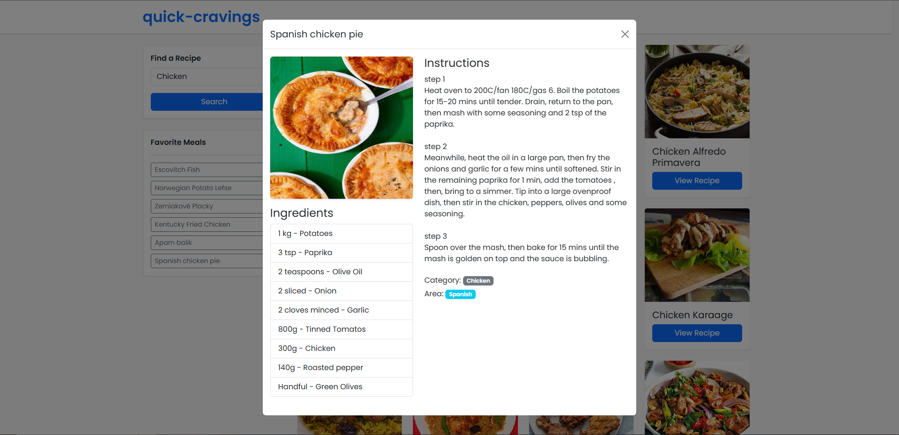
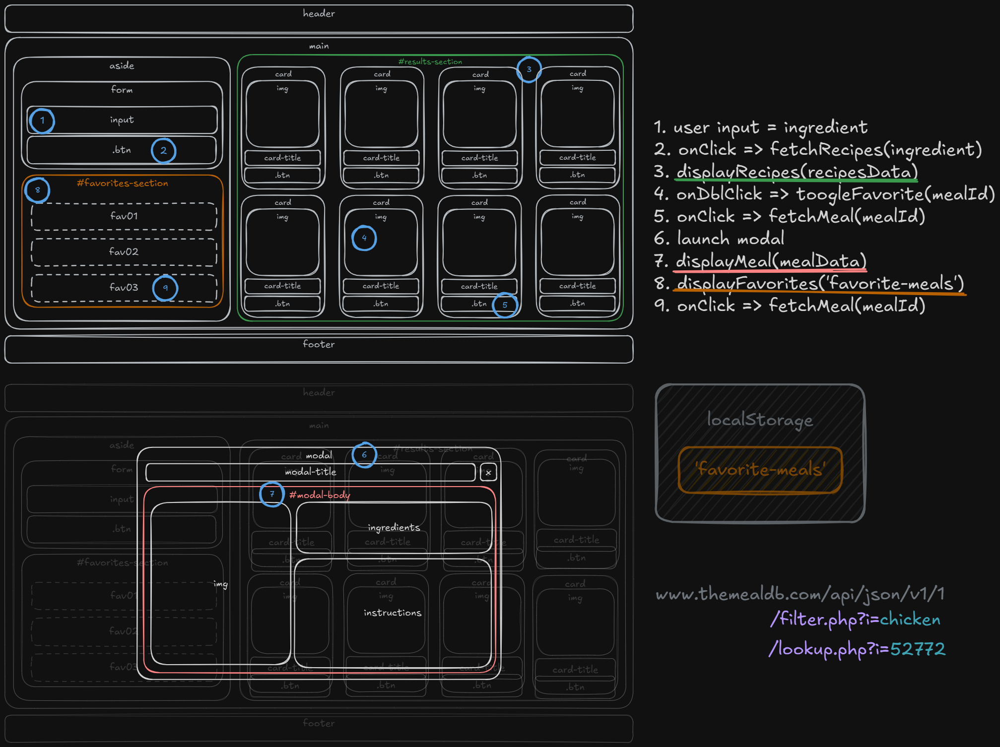

# QuickCravings – Recipe Finder
A simple, responsive web application that allows users to search for recipes by ingredient using TheMealDB API. Users can view recipe details in modals and save their favorite recipes for easy access.

## 🚀 Demo

 * **GitHub Pages:** [https://edgarciavfx.github.io/quick-cravings/](https://edgarciavfx.github.io/quick-cravings/)
 * **GitHub Repo:** [https://github.com/edgarciavfx/quick-cravings](https://github.com/edgarciavfx/quick-cravings)

## 🛠️ Technologies

Here is the full tech stack used in this project:

* **HTML5**
* **CSS3** (Bootstrap 5 utilities)
* **Vanilla JavaScript**
* **TheMealDB API**

Features

* **Search by ingredient** – Type an ingredient and instantly get recipe cards.
* **Dynamic modal details** – Each card button opens a modal with full recipe info.
* **Responsive grid** – Mobile-first layout, cards adjust automatically.
* **Favorites System** – Save recipes and view them in a dedicated sidebar.
* **Loading & Error States** – Clear UI feedback during API calls.

## 📸 Screenshot



---

## 🧩 How It Works

A high‑level overview of the application's behavior and logic: (Architecture Overview)

1. **User enters an ingredient** in the search bar.
2. App calls **TheMealDB API** to fetch recipes containing that ingredient.
3. Results are rendered as a **responsive card grid**.
4. Clicking a card button triggers a **fetch for full recipe details**.
5. Details are displayed inside a **dynamically generated Bootstrap modal**.
6. User can **save/remove favorites** via double‑click on cards.
7. Favorites persist using **localStorage**, even after reload.
8. A **favorites sidebar** displays saved meals.
9. Loading and error states provide clear UI feedback.

## 📁 Project Structure

```
quick-cravings/
├── assets/
│   ├── css/
│   │   └── styles.css
│   ├── js/
│   │   └── script.js
│   ├── screenshot.png
├── index.html
├── LICENSE
├── README.md
```

## 📄 Setup & Run

1. **Clone the repository:**

```bash
git clone https://github.com/your-username/quick-cravings.git
```

2. **Enter the folder:**

```bash
cd quick-cravings
```

3. **Run a local server:**

```bash
# Option A – VS Code Live Server
# Option B – Python simple server
python3 -m http.server 5500
```

4. **Open in browser:**

```
http://localhost:5500
```

## ⭐ Why I Built This

QuickCravings was created as my Week 7 solo project for Codecademy’s Full Stack Bootcamp. I wanted a practical yet meaningful way to strengthen my JavaScript fundamentals while working with real API data and user interactions.

This project became the perfect space to practice:

- **Fetching and handling external APIs** (TheMealDB)
- **Building an interactive UI** with search, dynamic cards, and custom modals
- **Using Bootstrap utility classes effectively** without heavy custom CSS
- **Designing a clean, readable layout** with a mobile-first approach
- **Structuring code with clarity**, mimicking component-like logic even without frameworks

Beyond meeting the project’s core requirements, I used QuickCravings to push myself toward stretch-goal skills like loading states, friendly error messages, and client-side storage (favorites).  
Overall, this project became a portfolio-ready example of my front-end workflow, problem-solving, and attention to UI/UX detail.

## 🖼️ Wireframe



## 📘 What I Learned

* Writing clean, modular JavaScript
* Fetching & rendering API data
* Handling dynamic modals
* Managing persistent state with `localStorage`
* Designing responsive, mobile‑first layouts
* Implementing loading & error feedback

## 📄 License

This project is licensed under the **MIT License**.
